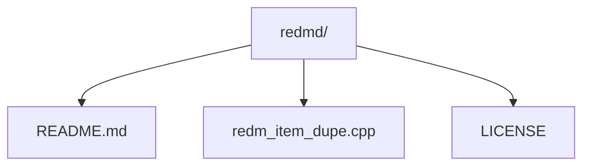

# RedmD

**RedM** sunucularında item dupe işlemi gerçekleştirebileceğiniz bir C++ bazlı yazılımdır. Kod, basit bir yapıya sahip olup hedeflenen eşyaları hızlı ve etkili bir şekilde kopyalamanıza olanak sağlar. Bu araç, tamamen kullanıcı paylaşımı amacıyla geliştirilmiştir. Kötüye kullanımdan tamamen kullanıcı sorumludur.

---

## Özellikler

- Hedef sunuculardaki **item ID** veya **eşya adı** ile çalışma.
- Anlık kopyalama işlemi.
- Minimal gecikme ile optimize edilmiş süreç.

---

## Gereksinimler

Bu kodu kullanmadan önce aşağıdaki gereksinimleri karşılamanız gerekmektedir:

- **C++** (CLion önerilir)
- **Windows** veya **Linux** işletim sistemi
- RedM için çalışır durumda server.

---

## Kurulum

1. **Kaynak kodunu indir:**

```bash
git clone https://github.com/kullanici-adi/redmd.git
cd redmd
```

2. **Projeyi derle:**

Linux:
```bash
g++ -o redmd
```

3. **Başlat ve keyfi item ID gir:**

```bash
./redmd
```

---

## Kullanım

1. Program çalıştırıldıktan sonra, hedef sunucuya bağlanın.
2. Program sizden **item ID** veya **eşya adı** bilgisi isteyecektir. Doğru bilgiyi girerek işlemi başlatabilirsiniz.
3. İşlem tamamlandığında, duplicasyon yapılan eşyalar envanterinizde görünecektir.

---

## Dosya Yapısı


---

## Lisans

Bu proje [MIT Lisansı](LICENSE) ile lisanslanmıştır. Daha fazla bilgi için `LICENSE` dosyasını inceleyebilirsiniz.

---
